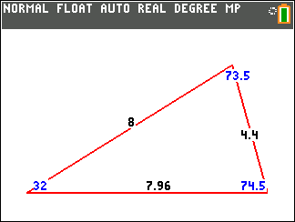
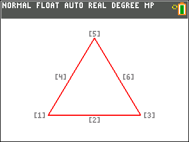
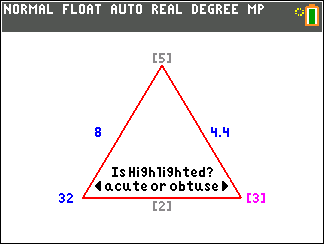
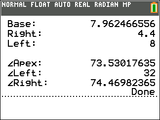
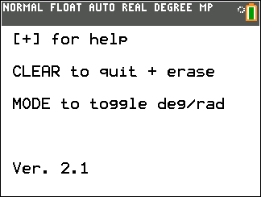

# TI-84 Triangle Solver

A triangle-solving program for the TI-84 Plus CE line of calculators featuring robust error handling and an intuitive GUI.

Given 3 dimensions of a triangle, the program will solve the remaining dimensions and render a geometrically proportional triangle, similar to a tool like http://cossincalc.com.

 

## Features

- Outputs a full-screen, to-scale, dimensioned triangle
- Detects and supports ambiguous case, with additional dialog
- Degree and radian modes
- Sanitizes user input, catches invalid triangles
- Catches invalid triangles
- Stores triangle dimensions & area to persistent variables

## Installation

1. Download the latest `.8xp` binary from [Releases](https://github.com/munr0/Ti-84-Triangle-Solver/releases/latest)
1. Set up [TI Connect™ CE](https://education.ti.com/en/products/computer-software/ti-connect-ce-sw)
1. Follow [TI's instructions](https://education.ti.com/html/eguides/connectivity/TI-Connect-CE/EN/Content/EG_84_TIConnect/M_UseProgEditor/DT_Send_Program_to_Calc.HTML) for sending the program to a connected calculator

## Usage

### Starting the Program

1. Press `[PRGM]`
1. Select `TRIG` from the list
1. Press `[ENTER]` to execute

### Entering Dimensions

The interface displays a triangle with six labeled positions:

<table>
<tr>
<td><h3 align="center">[4]</h3><b>Side C</b> <i>left side</i></td>
<td><h3 align="center">[5]</h3><b>Angle D</b> <i>apex</i></td>
<td><h3 align="center">[6]</h3><b>Side B</b> <i>right side</i></td>
</tr>
<tr>
<td><h3 align="center">[1]</h3><b>Angle E</b> <i>left corner</i></td>
<td><h3 align="center">[2]</h3><b>Side A</b> <i>base</i></td>
<td><h3 align="center">[3]</h3><b>Angle F</b> <i>right corner</i></td>
</tr>
</table>

**To input a dimension:**
- Press the number key corresponding to the dimension you want to specify
 - Keypad layout matches screen positions
- Enter the dimension value when prompted

**After 3 dimensions have been entered, the program will either:**
- Attempt to solve the triangle geometry
- Proceed to ambiguous case handling
- Reject input (invalid dimensions to form a valid triangle)

### Ambiguous Case

In the case where the 3 given dimensions result in *two* valid triangles, the user is prompted to identify a specific (highlighted) vertex as either acute or obtuse.

- Press `[◄]` for the acute solution
- Press `[►]` for the obtuse solution

 

### Viewing Results

After solving, the program displays a scale, dimensioned triangle in the plotting environment.
- Angles are labeled in blue
- Side lengths are labeled in black

Press `[ENTER]` to leave the diagram and reveal additional output digits.

<table align="left">
<tr>
<th>Dimension</th>
<th align="center">Persistent Variable</th>
</tr>
<tr>
<td>Bottom Side Length</td>
<td align="center"><code>A</code></td>
</tr>
<tr>
<td>Right Side Length</td>
<td align="center"><code>B</code></td>
</tr>
<tr>
<td>Left Side Length</td>
<td align="center"><code>C</code></td>
</tr>
<tr>
<td>Top Vertex Angle</td>
<td align="center"><code>D</code></td>
</tr>
<tr>
<td>Left Vertex Angle</td>
<td align="center"><code>E</code></td>
</tr>
<tr>
<td>Right Vertex Angle</td>
<td align="center"><code>F</code></td>
</tr>
<tr>
<td>Area</td>
<td align="center"><code>X</code></td>
</tr>
</table>

 
 

### Special Keys

- `[+]` – display help menu
- `[CLEAR]` – gracefully quit program (erase plot)
- `[MODE]` – toggle between degree and radian modes

### Error Handling

The program displays **"invalid dimensions!"** if the input doesn't form a valid triangle (negative values, angles ≥180°, triangle inequality violations).

 

## Files
- `*.8xp` – native TI-BASIC binary source code
- `TRIG.bas` – minimal TI-BASIC source code, in ASCII form
- `TRIG-commented.txt` – source code with descriptive comments
